# Continuous Integration With Jenkins, Ansible, Artifactory, SonarQube & PHP

**Step 0 - Prerequisites**
---

**Note that this is a continuation from the previous project. In that project, the root directory is called `ansible-config-mgt`. Since I started this one from scratch, the name of the root directory in this project is `ansiblecfg`. However, they are the same**


- Set up servers for Jenkins, SonarQube and a MySQL database.

*Use a RHEL instance for the database. Using ubuntu caused issues that will be documented below*

- Ensure ansible inventory folder is set up correctly. See example below:

```
├── ci
├── dev
├── pentest
├── pre-prod
├── prod
├── sit
└── uat
```

- Ensure the required hosts are placed in the right inventory file. In this case, I used `dev.yml` as my inventory host file.

**Step 1 - Configuring Ansible For Jenkins Development**
---

*To be able to run Ansible commands from the Jenkins UI (instead of sshing to the server and run it there --bad idea for real life scenarios), we would need to install the Ansible plugin for Jenkins so plays can be run directly from the Jenkins UI*

- Start up Jenkins and open Blue Ocean. From there, create a new pipeline job from the Blue Ocean UI.

*Ensure that the repository you choose has a `Jenkinsfile` present before you create the pipeline. Jenkins will automatically recommend creating a `Jenkinsfile` for you if it does not detect one in the repo*

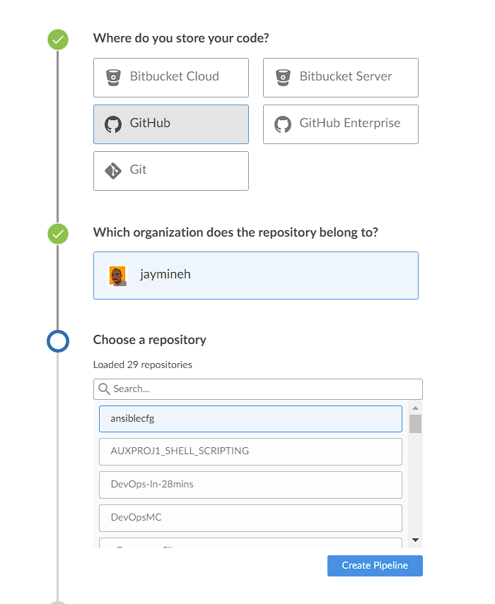

- In the `ansiblecfg` root directory, create a folder called `deploy`. Go into the `deploy` folder and create a `Jenkinsfile` and switch to a new git branch called `feature/jenkinspipeline`

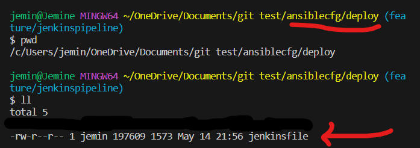

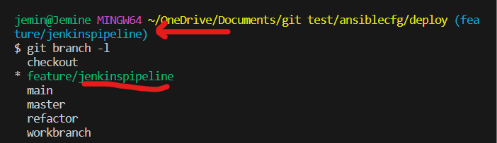

- Insert the code below into the `Jenkinsfile` that was just created. This is done to test if the pipeline is configured correctly and working properly. The script itself does nothing and is just an echo shell script.

```
('Build') {
      steps {
              script {
	             pipeline {
  agent any

  stages {
    stage   sh 'echo "Building Stage"'
        }
      }
    }

    stage('Test') {
      steps {
        script {
          sh 'echo "Testing Stage"'
        }
      }
    }

    stage('Package') {
      steps {
        script {
          sh 'echo "Testing Stage"'
        }
      }
    }

    stage('Deploy') {
      steps {
        script {
          sh 'echo "Testing Stage"'
        }
      }
    }

    stage('Clean up') {
      steps {
        script {
          sh 'echo "Testing Stage"'
        }
      }
    }
  }
}
```

*The above stages can be added step by step (i.e build stage, test stage, etc) to see howthings progress*

- After adding the above code to the Jenkinsfile, push to GitHub and go to the Jenkins UI to configure where the pipeline would look when executing scripts. This location should be where the Jekinsfile is located.

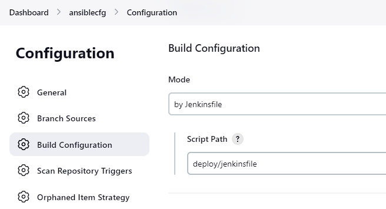

- After saving your settings, click on **Scan Repository Now** for Jenkins to scan the selected repository to get the latest changes pushed to GitHub and also the branches that were created. Once this is done, you can either let the build run automatically or go into Blue Ocean and run it manually. See result of successful run below:

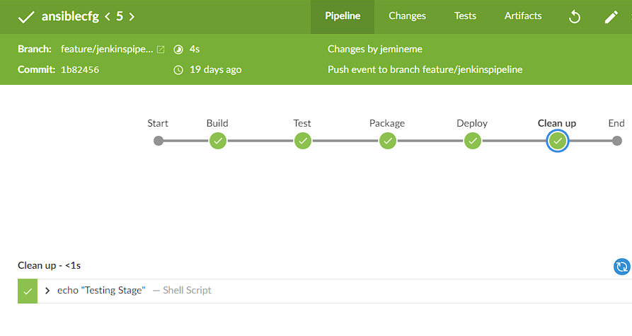

- Install the Ansible plugin from the Jenkins store. This is the module that would make Jenkins be able to run Ansible scripts.

- Clear the contents of the first Jenkinsfile (or delete it and create a new one), then paste the code below into the Jenkinsfile:

```
pipeline {
    agent any

    parameters {
      string(name: 'inventory', defaultValue: 'dev.yml',  description: 'This is the inventory file for the environment to deploy configuration')
    }

  stages {
    stage("Initial Clean Up") {
      steps {
        dir("${WORKSPACE}") {
           deleteDir()
        }
      }
    }

    stage('SCM Checkout') {
      steps {
        git branch: 'main', url: 'https://github.com/jaymineh/ansiblecfg.git'
      }
    }
    
    stage('Execute Playbook') {
      steps {
        withEnv(['ANSIBLE_CONFIG = ${WORKSPACE}/deploy/.ansible.cfg']) {
          ansiblePlaybook credentialsId: 'private-key', disableHostKeyChecking: true, installation: 'ansible2', inventory: 'inventory/${inventory}', playbook: 'playbooks/site.yml', tags: 'webservers'
        }
      }
    }
  }
}

```

*Notice that we included parameterization in the above code, which enables us to input the appropriate values for the inventory file we want to run the playbook against. See parameterization section below*

```
 parameters {
      string(name: 'inventory', defaultValue: 'dev.yml',  description: 'This is the inventory file for the environment to deploy configuration')
    }
```

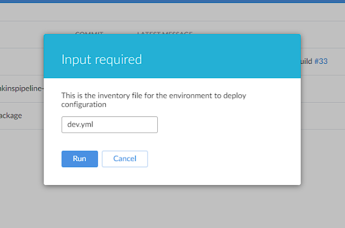

*The `Pipeline Syntax` in Jenkins can be used to generate pipeline script for a Jenkinsfile. It is very good for learning how to properly structure a Jenkinsfile*

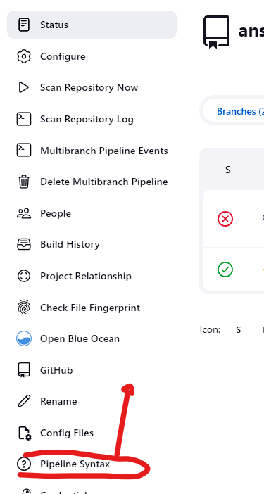

- Before running the build job, go to the deploy folder on the local machine and create the `ansible.cfg` file. This is te environment variable where some configs and paths are declared within. It should be placed in the `deploy` folder alongside the `Jenkinsfile`. Paste the code below into the `Jenkinsfile`:

```
[defaults]
roles_path=/opt/ansible/ansiblecfg/roles
timeout = 160
callback_whitelist = profile_tasks
log_path=~/ansible.log
host_key_checking = False
gathering = smart
ansible_python_interpreter=/usr/bin/python3
allow_world_readable_tmpfiles=true


[ssh_connection]
ssh_args = -o ControlMaster=auto -o ControlPersist=30m -o ControlPath=/tmp/ansible-ssh-%h-%p-%r -o ServerAliveInterval=60 -o ServerAliveCountMax=60 -o ForwardAgent=yes
```

- Run the Jenkins job. Confirm that ansible runs against all hosts.
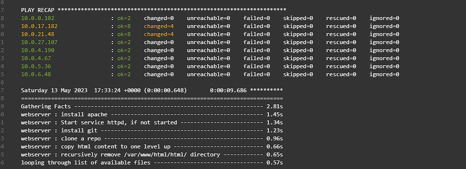

*I was having this error `fatal: [10.0.12.51]: FAILED! => {"ansible_facts": {}, "changed": false, "failed_modules": {"ansible.legacy.setup": {"failed": true, "module_stderr": "Shared connection to 10.0.12.51 closed.\r\n", "module_stdout": "\r\n/bin/sh: 1: /usr/bin/python: not found\r\n", "msg": "The module failed to execute correctly, you probably need to set the interpreter.\nSee stdout/stderr for the exact error", "rc": 127}}, "msg": "The following modules failed to execute: ansible.legacy.setup\n"}` on the database server saying that python couldn't be found. Despite trying reinstalling the exact python version needed and declaring the path, the issue persisted. However the issue went away when I created a new database based on RHEL as this one with the error was based on Ubuntu*

***Things To Note***
---

- You may sometimes notice that Jenkins does not download the latest code from GitHub (which may have a fix), and would continue runnig with errors. You can only detect this by checking the error log to know why it happened. The way to remediate this is by either running a cleanup step to clear the Jenkins workspace or logging into the Jenkins server and manually deleting the workspace folder in `var/lib/jenkins` and pull from GitHub into the Jenkins local server. That way, the workspace has the latest code to work with.

- Jenkins may fail when a different branch is indicated in the `Jenkinsfile`, compared to the one the branch is being run with.

**Step 2 - Setting Up The Artifactory Server**
---

*The tooling website has already been deployed through Ansible. Here, another PHP application will be introduced to the list of spftwares being managed in the infrastructure. This is also an ideal application to show an end-to-end CI/CD pipeline as this has unit tests*

*The goal here is to deploy the applications from Artifactory rather than Git. This can be done using an Artifactory server in the cloud or one you set up locally. I used the cloud variant in this example*

- Go to `https://artifactory.jfrog.io` and create an account. Next, create a new `local repository` where artifacts will be uploaded to from the Jenkins server.

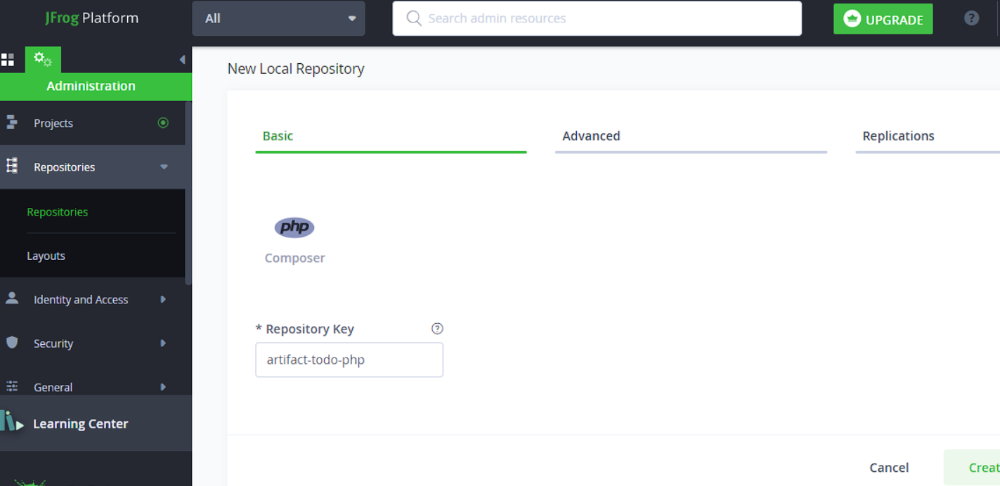

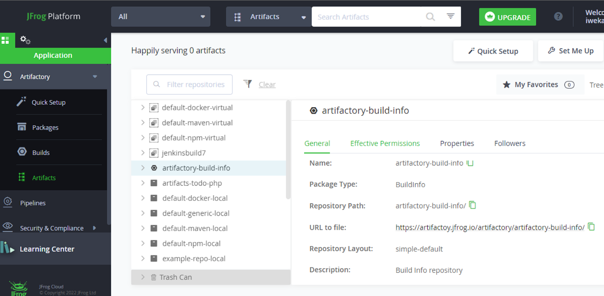

*The above images are examples and not the exact names of the repo I created*

**Step 3 - Integrating Artifactory Repo With Jenkins**
---

- Install the `Plot` plugin on Jenkins to display test reports, code coverage and artifactory plugins.

- Configure Artifactory in Jenkins for syncronization.

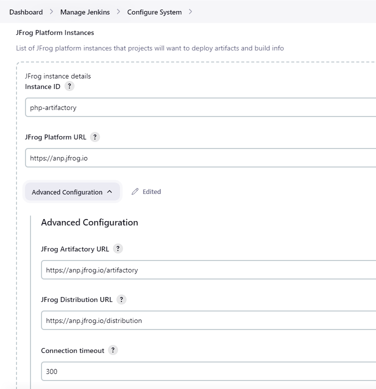


- Fork this repository `https://github.com/darey-devops/php-todo.git`.

- Created a new database and user

```
Create database homestead;
CREATE USER 'vergil'@'<Jenkins-ip-address>' IDENTIFIED BY 'spardason';
GRANT ALL PRIVILEGES ON * . * TO 'vergil'@'<Jenkins-ip-address>';
```

*Ensure to configure `bind_address` in the `my.cnf` file to `0.0.0.0 and port 3306 is open in the security group*

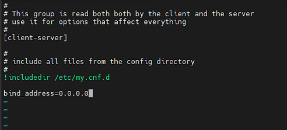

- Install PHP on the Jenkins server. *Ran into an issue where the default PHP version I had installed (v8) was too high. HAd to install v7.4 specifically. Got info from `https://www.tecmint.com/install-different-php-versions-in-ubuntu/`*

- Install PHP composer globally on Jenkins server.

```
php -r "copy('https://getcomposer.org/installer', 'composer-setup.php');"
php -r "if (hash_file('sha384', 'composer-setup.php') === '55ce33d7678c5a611085589f1f3ddf8b3c52d662cd01d4ba75c0ee0459970c2200a51f492d557530c71c15d8dba01eae') { echo 'Installer verified'; } else { echo 'Installer corrupt'; unlink('composer-setup.php'); } echo PHP_EOL;"
php composer-setup.php
php -r "unlink('composer-setup.php');"
sudo mv composer.phar /usr/local/bin/composer
```

- Update the `.env.sample` file with database server information.

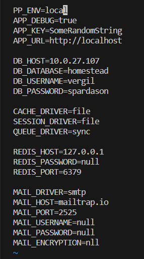

- Create a new Jenkinsfile for the previously forked repo on the main branch. The repo is now known as `todo`. Insert the code below into the Jenkinsfile.

```
pipeline {
    agent any

 stages {

    stage("Initial cleanup") {
      steps {
        dir("${WORKSPACE}") {
            deleteDir()
        }
      }
    }

    stage('Checkout SCM') {
      steps {
            git branch: 'main', url: 'https://github.com/jaymineh/todo.git'
      }
    }

    stage('Prepare Dependencies') {
      steps {
             sh 'mv .env.sample .env'
             sh 'composer install'
             sh 'php artisan migrate'
             sh 'php artisan db:seed'
             sh 'php artisan key:generate'
      }
    }
  }
}
```

- Create a new pipeline job from Jenkins (Blue Ocean). Job name is `todophp`. Run the pipeline after.

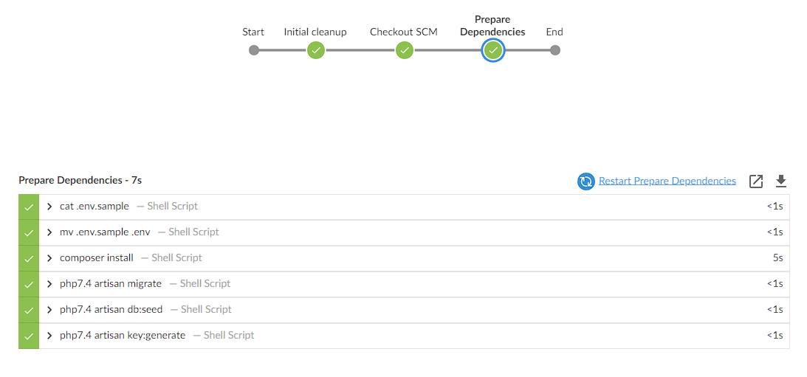

- After the above is completed, confirm by logging  into the database server and running the `show databases;` command to see the available databases. Select the `homestead` database by using use homestead;` and use `show tables` to display the inserted tables in the database.

*I ran into an error saying `composer not found` even when I installed composer on the server. I was able to resolve this by installing composer globally as my guess is that Jenkins was not able to call the composer tool properly*

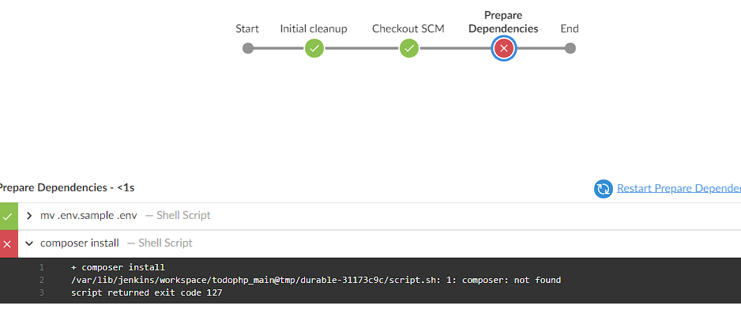

*I ran into another error which was permissions based. Jenkins was not being allowed to insert into the database. I tried changing permissions and even tried logging into the database with the same credential but I still faced the error. I realized I was pointing to the old Ubuntu database. This issue went away when I pointed to the new RHEL database. It looks like there are a lot of issues when using MYSQL on Ubuntu based machines.

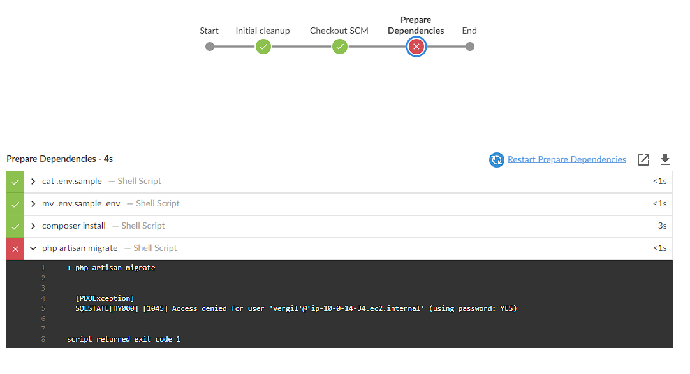

**Step 4 - Structuring The Jenkinsfile**
---

- Add the unit test stage in the Jenkinsfile.

```
stage('Execute Unit Tests') {
      steps {
             sh './vendor/bin/phpunit'
      } 
    }
```

- Add the code analysis stage with the phploc tool. Putput will be saved in build/logs/phploc.csv.

```
stage('Code Analysis') {
      steps {
        sh 'phploc app/ --log-csv build/logs/phploc.csv'

      }
    }
```

- Add the plot code coverage report stage.

```
 stage('Plot Code Coverage Report') {
      steps {

            plot csvFileName: 'plot-396c4a6b-b573-41e5-85d8-73613b2ffffb.csv', csvSeries: [[displayTableFlag: true, exclusionValues: 'Lines of Code (LOC),Comment Lines of Code (CLOC),Non-Comment Lines of Code (NCLOC),Logical Lines of Code (LLOC)                          ', file: 'build/logs/phploc.csv', inclusionFlag: 'INCLUDE_BY_STRING', url: '']], group: 'phploc', numBuilds: '100', style: 'line', title: 'A - Lines of code', yaxis: 'Lines of Code'
            plot csvFileName: 'plot-396c4a6b-b573-41e5-85d8-73613b2ffffb.csv', csvSeries: [[displayTableFlag: true, exclusionValues: 'Average Class Length (LLOC),Average Method Length (LLOC),Average Function Length (LLOC)', file: 'build/logs/phploc.csv', inclusionFlag: 'INCLUDE_BY_STRING', url: '']], group: 'phploc', numBuilds: '100', style: 'line', title: 'C - Average Length', yaxis: 'Average Lines of Code'
            plot csvFileName: 'plot-396c4a6b-b573-41e5-85d8-73613b2ffffb.csv', csvSeries: [[displayTableFlag: true, exclusionValues: 'Directories,Files,Namespaces', file: 'build/logs/phploc.csv', inclusionFlag: 'INCLUDE_BY_STRING', url: '']], group: 'phploc', numBuilds: '100', style: 'line', title: 'B - Structures Containers', yaxis: 'Count'
            plot csvFileName: 'plot-396c4a6b-b573-41e5-85d8-73613b2ffffb.csv', csvSeries: [[displayTableFlag: true, exclusionValues: 'Cyclomatic Complexity / Lines of Code,Cyclomatic Complexity / Number of Methods ', file: 'build/logs/phploc.csv', inclusionFlag: 'INCLUDE_BY_STRING', url: '']], group: 'phploc', numBuilds: '100', style: 'line', title: 'D - Relative Cyclomatic Complexity', yaxis: 'Cyclomatic Complexity by Structure'      
            plot csvFileName: 'plot-396c4a6b-b573-41e5-85d8-73613b2ffffb.csv', csvSeries: [[displayTableFlag: true, exclusionValues: 'Classes,Abstract Classes,Concrete Classes', file: 'build/logs/phploc.csv', inclusionFlag: 'INCLUDE_BY_STRING', url: '']], group: 'phploc', numBuilds: '100', style: 'line', title: 'E - Types of Classes', yaxis: 'Count'
            plot csvFileName: 'plot-396c4a6b-b573-41e5-85d8-73613b2ffffb.csv', csvSeries: [[displayTableFlag: true, exclusionValues: 'Methods,Non-Static Methods,Static Methods,Public Methods,Non-Public Methods', file: 'build/logs/phploc.csv', inclusionFlag: 'INCLUDE_BY_STRING', url: '']], group: 'phploc', numBuilds: '100', style: 'line', title: 'F - Types of Methods', yaxis: 'Count'
            plot csvFileName: 'plot-396c4a6b-b573-41e5-85d8-73613b2ffffb.csv', csvSeries: [[displayTableFlag: true, exclusionValues: 'Constants,Global Constants,Class Constants', file: 'build/logs/phploc.csv', inclusionFlag: 'INCLUDE_BY_STRING', url: '']], group: 'phploc', numBuilds: '100', style: 'line', title: 'G - Types of Constants', yaxis: 'Count'
            plot csvFileName: 'plot-396c4a6b-b573-41e5-85d8-73613b2ffffb.csv', csvSeries: [[displayTableFlag: true, exclusionValues: 'Test Classes,Test Methods', file: 'build/logs/phploc.csv', inclusionFlag: 'INCLUDE_BY_STRING', url: '']], group: 'phploc', numBuilds: '100', style: 'line', title: 'I - Testing', yaxis: 'Count'
            plot csvFileName: 'plot-396c4a6b-b573-41e5-85d8-73613b2ffffb.csv', csvSeries: [[displayTableFlag: true, exclusionValues: 'Logical Lines of Code (LLOC),Classes Length (LLOC),Functions Length (LLOC),LLOC outside functions or classes ', file: 'build/logs/phploc.csv', inclusionFlag: 'INCLUDE_BY_STRING', url: '']], group: 'phploc', numBuilds: '100', style: 'line', title: 'AB - Code Structure by Logical Lines of Code', yaxis: 'Logical Lines of Code'
            plot csvFileName: 'plot-396c4a6b-b573-41e5-85d8-73613b2ffffb.csv', csvSeries: [[displayTableFlag: true, exclusionValues: 'Functions,Named Functions,Anonymous Functions', file: 'build/logs/phploc.csv', inclusionFlag: 'INCLUDE_BY_STRING', url: '']], group: 'phploc', numBuilds: '100', style: 'line', title: 'H - Types of Functions', yaxis: 'Count'
            plot csvFileName: 'plot-396c4a6b-b573-41e5-85d8-73613b2ffffb.csv', csvSeries: [[displayTableFlag: true, exclusionValues: 'Interfaces,Traits,Classes,Methods,Functions,Constants', file: 'build/logs/phploc.csv', inclusionFlag: 'INCLUDE_BY_STRING', url: '']], group: 'phploc', numBuilds: '100', style: 'line', title: 'BB - Structure Objects', yaxis: 'Count'

      }
    }
```

- Add the package artifacts stage which archives the application code to be uploaded to Artifactory. Ensure zip` & `unzip` are installed on the Jenkins server else it will run into an error being unable to extract the .zip file.

```
stage ('Package Artifact') {
    steps {
            sh 'zip -qr todophp.zip ${WORKSPACE}/*'
     }
    }
```

- Add the uploading artifact to artifactory stage. Ensure the pattern and the target are the same as was specified in the earlier created artifactory repository.

```
 {
       steps {
               script { 
	                           stage('Upload Artifact to Artifactory') def server = Artifactory.server 'php-artifactory'                 
                def uploadSpec = """{
                    "files": [
                      {
                       "pattern": "todophp.zip",
                       "target": "php-artifactory",
                       "props": "type=zip;status=ready"

                      }
                    ]
                }""" 

              server.upload spec: uploadSpec
        }
      }
    }
```

- Added the deploy to dev environment by launching the ansible pipeline job (ansiblecfg). Ensure the inventory file (dev.yml) contains the private IP of the intended servers and the site.yml is updated with the play.

```
stage ('Deploy to Dev Environment') {
    steps {
    build job: 'ansible-project/main', parameters: [[$class: 'StringParameterValue', name: 'env', value: 'dev']], propagate: false, wait: true
    }
  }
```

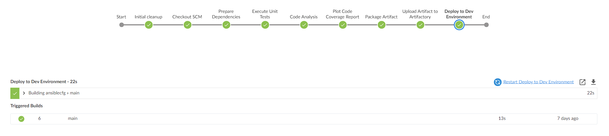

**Step 5 - Setting Up The SonarQube Server**
---

*SonarQube is a tool that is used to create quality gates for software projects, with the ultimate goal of being able to ship quality software code*

*SonarQube can be installed in 2 ways; one is using an ansible role to automate the installation and the other is installing manually. I did both and will show both*

***Automated***

- Use `ansible galaxy` to install SonarQube. `ansible-galaxy install lrk.sonarqube`

***Manual***

- On the SonarQube server, perform the following command to make the session changes persist to ensure optimal performance of the tool.

```
$ sudo sysctl -w vm.max_map_count=262144
$ sudo sysctl -w fs.file-max=65536
$ ulimit -n 65536
$ ulimit -u 4096
```

- To make the changes permanent, edit the `limits.conf` file in `/etc/security/limits.conf` and enter the following.

```
sonarqube   -   nofile   65536
sonarqube   -   nproc    4096

```

- Update and upgrade the server.

- Install wget, zip and unzip.

```
sudo yum install wget zip unzip -y
```

- Install OpenJDK and JRE 11.

```
sudo yum install openjdk-11-jdk -y
```

- Verify that java is installed and what version is installed.

```
java --version
```

- Install PostgresQL on the SonarQube server.

```
sudo dnf install -y https://download.postgresql.org/pub/repos/yum/reporpms/EL-9-x86_64/pgdg-redhat-repo-latest.noarch.rpm
sudo dnf -qy module disable postgresql
sudo dnf install -y postgresql15-server
sudo /usr/pgsql-15/bin/postgresql-15-setup initdb
sudo systemctl enable postgresql-15
sudo systemctl start postgresql-15
```

- Change password for default postgres user.

```
sudo passwd postgres
```

- Switch to the postgres user and create a new user called 'sonar'.

```
su - postgres
createuser sonar
```

- Activate the postgresql shell with `psql`.

- Run the following commands to change password for newly created user for SonarQube, create a new database and grant all privileges to the new 'sonar' user on the SonarQube DB.

```
ALTER USER sonar WITH ENCRYPTED password 'sonar';
CREATE DATABASE sonarqube OWNER sonar;
grant all privileges on DATABASE sonarqube to sonar;
```

- Run the command below to download the SonarQube installation file.

```
cd /tmp && sudo wget https://binaries.sonarsource.com/Distribution/sonarqube/sonarqube-7.9.3.zip
```

- Unzip the archive setup to the '/opt' directory and rename the extracted folder

```
sudo unzip sonarqube-7.9.3.zip -d /opt
sudo mv /opt/sonarqube-7.9.3 /opt/sonarqube
```

- Create group called 'sonar' and add a user with control over the `/opt/sonarqube` directory.

```
sudo groupadd sonar
sudo useradd -c "user to run SonarQube" -d /opt/sonarqube -g sonar sonar
sudo chown sonar:sonar /opt/sonarqube -R
```

- Open the SonarQube config file `sudo vim /opt/sonarqube/conf/sonar.properties` and insert the following.

```
sonar.jdbc.username=sonar
sonar.jdbc.password=sonar
sonar.jdbc.url=jdbc:postgresql://localhost:5432/sonarqube
```

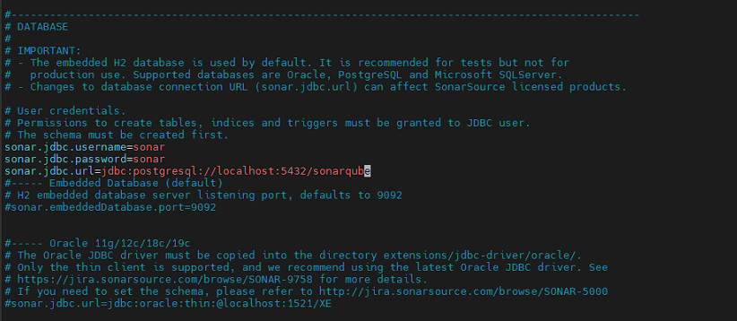

- Edit the sonar script file and uncomment RUN_AS_USER to make it active.

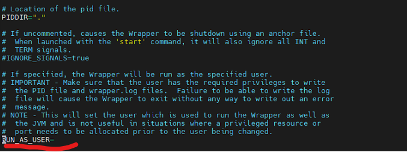

- To start SonarQube, do the following:

```
sudo su sonar
cd /opt/sonarqube/bin/linux-x86-64/
./sonar.sh start
./sonar.sh status
```

- To check SonarQube logs, run `tail /opt/sonarqube/logs/sonar.log`

- To configure SonarQube as a service, do the following:

```
cd /opt/sonarqube/bin/linux-x86-64/
./sonar.sh stop
exit
sudo nano /etc/systemd/system/sonar.service
```
- Enter the code below into the sonar.service file

```
[Unit]
Description=SonarQube service
After=syslog.target network.target

[Service]
Type=forking

ExecStart=/opt/sonarqube/bin/linux-x86-64/sonar.sh start
ExecStop=/opt/sonarqube/bin/linux-x86-64/sonar.sh stop

User=sonar
Group=sonar
Restart=always

LimitNOFILE=65536
LimitNPROC=4096

[Install]
WantedBy=multi-user.target
```

- Start and enable to SonarQube service

```
sudo systemctl start sonar
sudo systemctl enable sonar
sudo systemctl status sonar
```

- Access SonarQube through your browser by entering the following URL `http://<server_IP>:9000`. Ensure port 9000 is open in the NSG.

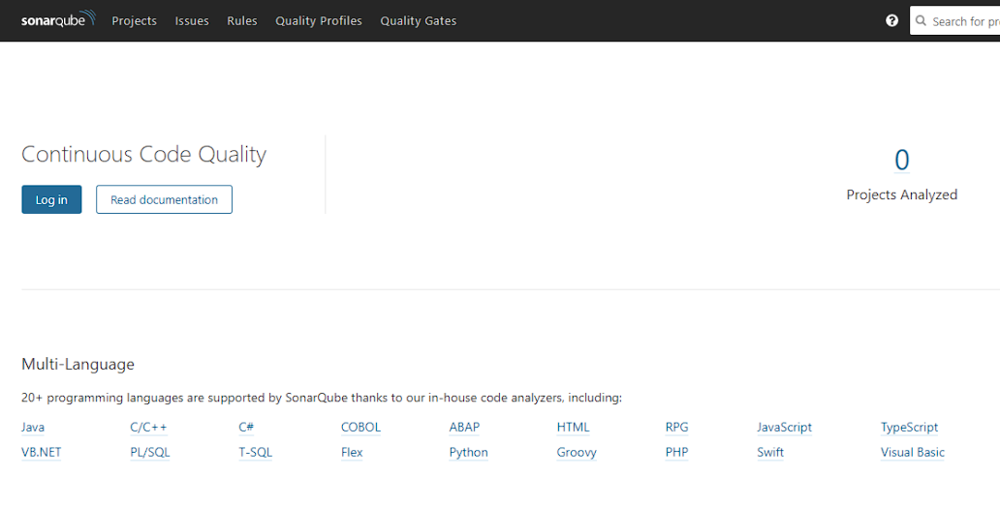

- Log in as admin

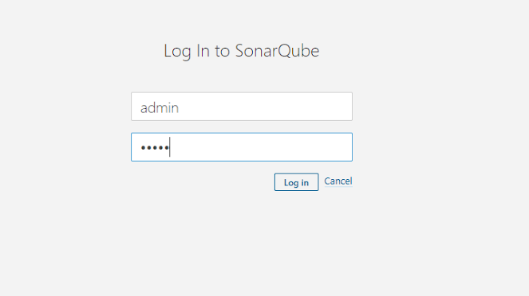


**Step 6 - Configuring Jenkins For SonarQube Quality Gate**
---

- Generate an authentication token in the SonarQube server. Navigate fromo **My Account** to **Security**.

- Configure Quality Gate Jenkins Webhook in SonarQube by navigating from the **Administration** page to **Webhook**. Create a webhook by specifying the URL as `http://<Jenkins-IP-Address>/sonarqube-webhook/

- Install the SonarScanner plugin in Jenkins.

- Go to the **Configure System** in Jenkins to add the SonarQube server details with the generated token.

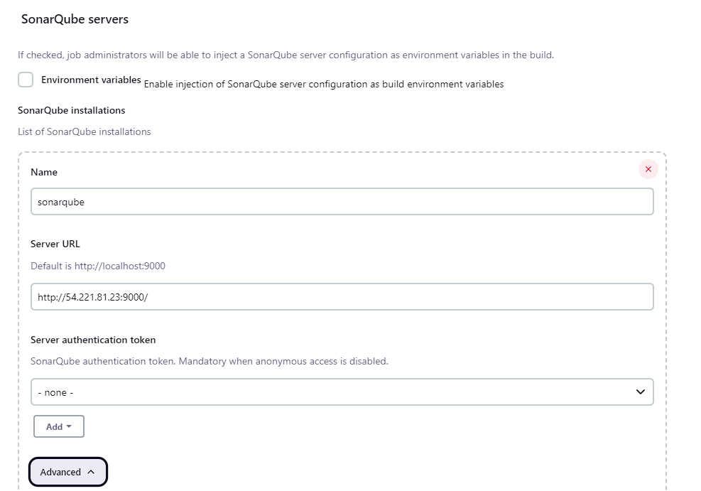

- Configure the SonarQube scanner in **Global Tool Configuration**.

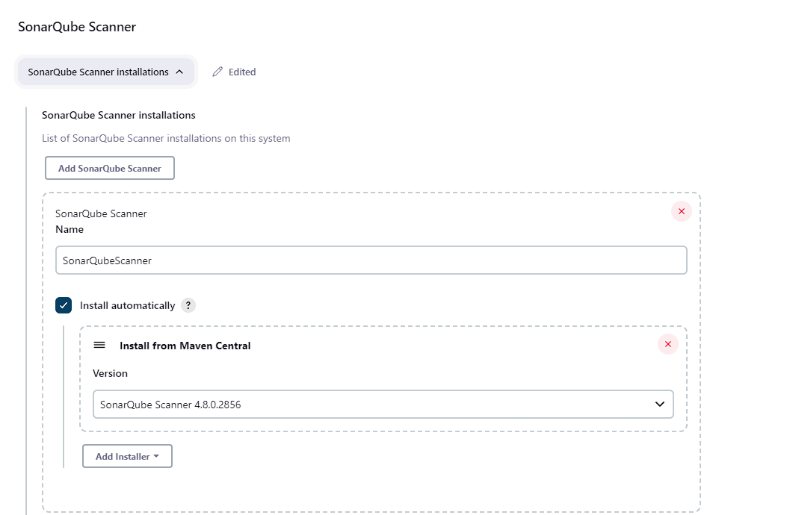

- Update the Jenkinsfile to include SonarQube Scanning and Quality Gate.

```
stage('SonarQube Quality Gate') {
      environment {
          scannerHome = tool 'SonarQubeScanner'
      }
        steps {
          withSonarQubeEnv('sonarqube') {
              sh "${scannerHome}/bin/sonar-scanner"
          }

        }
    }
    
```

- Configure the `sonar-scanner.properties` file in which SonarQube will require to function during pipeline execution `sudo vim /var/lib/jenkins/tools/hudson.plugins.sonar.SonarRunnerInstallation/SonarQubeScanner/conf/sonar-scanner.properties`.

- Enter the configuration below.

```
sonar.host.url=http://<SonarQube-Server-IP-address>:9000
sonar.projectKey=php-todo
#----- Default source code encoding
sonar.sourceEncoding=UTF-8
sonar.php.exclusions=**/vendor/**
sonar.php.coverage.reportPaths=build/logs/clover.xml
sonar.php.tests.reportPath=build/logs/junit.xml

```

*The pipeline will fail if this configuration is not done*

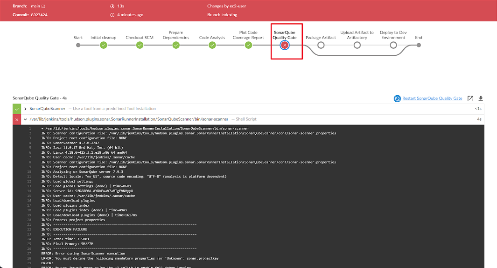

**Step 7 - Running The Pipeline Job**
---

- Upload your code to gitHub and click on **scan repository now** to get the latest changes so Jenkins can start the pipeline job.

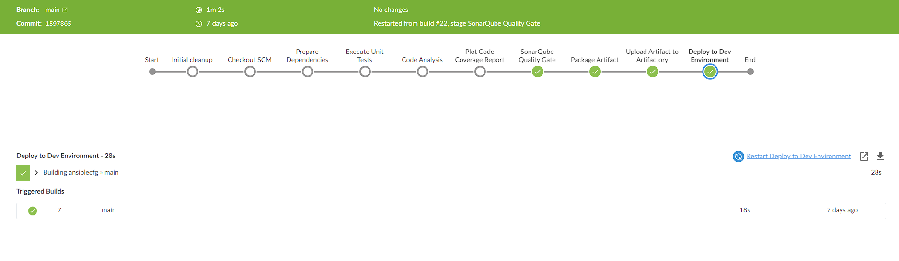

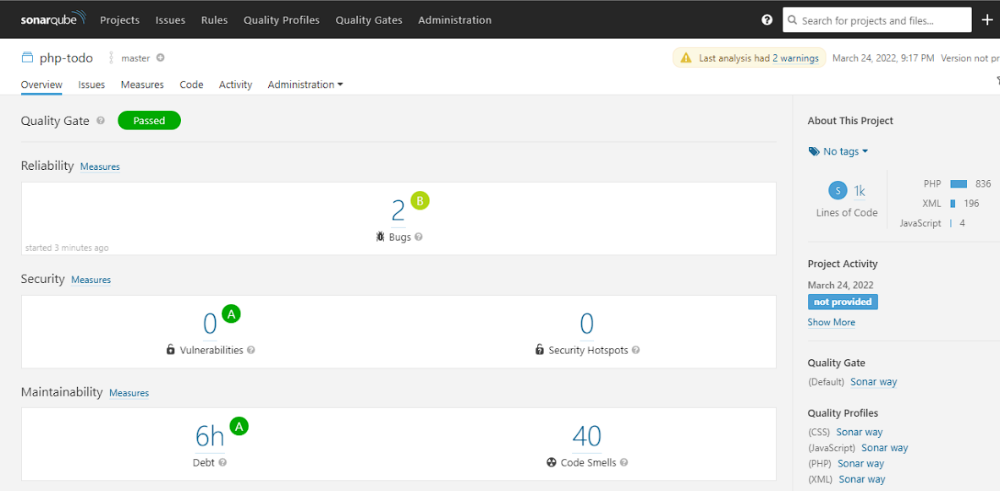

*I ran into an error saying it couldn't find node.js even when it was installed. Tried again and it ran*


- Add this code to the existing Jenkinsfile to ensure that only the pipeline job that is run on the specified branch (be it main, develop etc) makes it ti the deploy stage. 

```
 stage('SonarQube Quality Gate') {
      when { branch pattern: "^develop*|^hotfix*|^release*|^main*", comparator: "REGEXP"}
        environment {
            scannerHome = tool 'SonarQubeScanner'
        }
        steps {
            withSonarQubeEnv('sonarqube') {
                sh "${scannerHome}/bin/sonar-scanner -Dproject.settings=sonar-project.properties -Dsonar.projectKey=php-todo"
            }
            timeout(time: 1, unit: 'MINUTES') {
                waitForQualityGate abortPipeline: true
            }
        }
    }
```

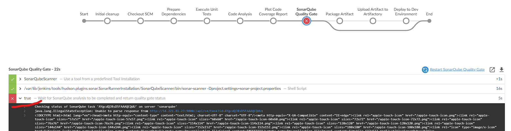

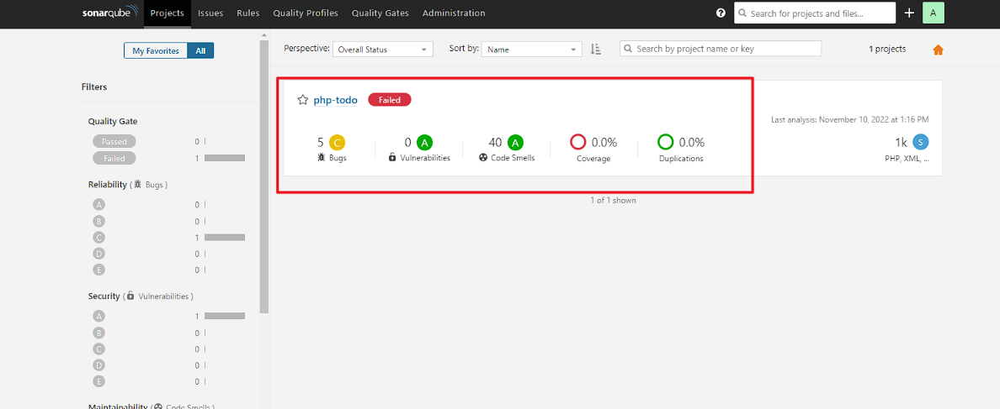

*The above result shows that there are bugs and there is 0.0% code coverage (unit tests added by developers to test functions and objects in the code) and 6 hours worth of technical debt, code smells and security issues in the code. The above result showed that the quality gate step failed because the conditions for quality were not met.*

*This can be seen as a basic GitFlow implementation as the above implementation restricts the deployment of code from unauthorized branches*


Step 8 - Running The Pipeline Job With 2 Jenkins Agents/Slaves (Nodes)
---

- Create a new node and name it `sonar1`. Configue the node and set the label as `slaveNode1`. ensure the configuration for the node looks like the picture below:

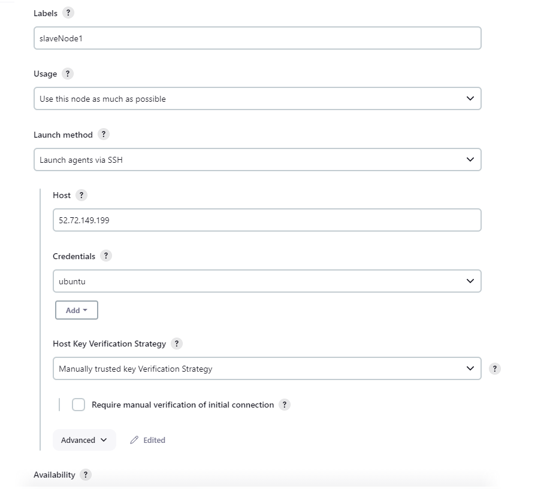

*Ensure the **remote root directory** and credentials are correct as it will lead to an authentication error when trying to launch the node*

- Create a new node named `sonar2`. This can be cloned from `sonar1` but the label should be updated to `slaveNode2`.

- Update Jenkinsfile with code below to be able to run the pipeline on two nodes.

```
pipeline {
    agent  { label 'slaveNode1' }
```

- Refresh the repo on Jenkins and execute the pipeline job. Monitor the run of both nodes until completion.

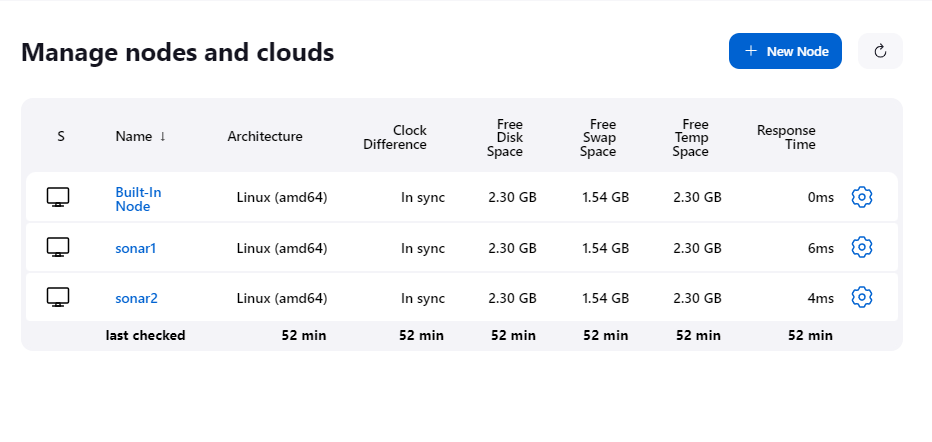

**Project 14 Deployed Successfully!**
